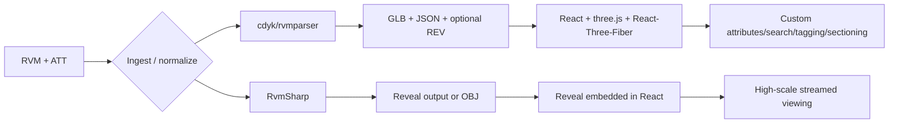
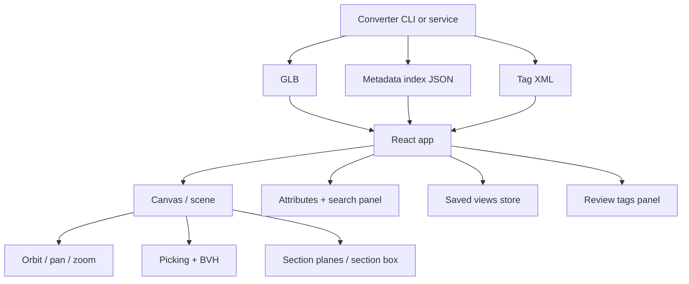
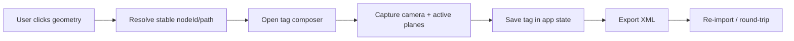
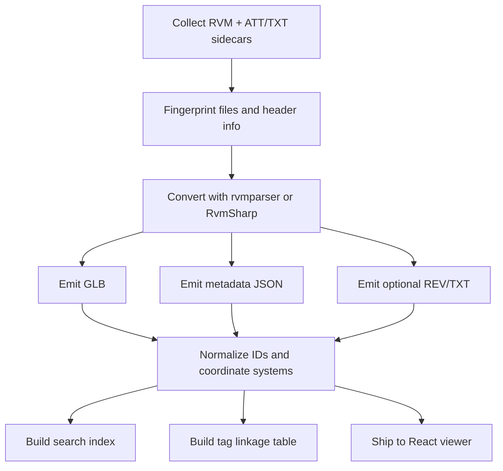

# Adaptable RVM Viewer Implementations for a React-Based RVM Viewer

## Executive Summary

The evidence supports a two-stage architecture rather than a direct in-browser RVM loader. RVM is treated by current open-source parsers and commercial importers as an ingestion format, usually paired with an ATT or TXT sidecar for metadata. Official importer documentation also notes that RVM can contain both tessellated meshes and BREP geometry, which often needs tessellation before web delivery. In the web stack itself, three.js documents loaders for formats such as glTF, OBJ, and VRML, while an RVM loader request exists as an unresolved issue rather than a supported loader. In practice, that makes “RVM/ATT in, normalized web payload out” the highest-confidence path. Primary-source evidence comes mainly from repos and docs published on entity["company","GitHub","code hosting platform"] by contributors around the entity["organization","AVEVA","industrial software company"] ecosystem, plus official docs from entity["organization","Equinor","energy company"], entity["organization","Cognite","industrial software company"], entity["organization","buildingSMART","openbim standards body"], entity["organization","Unity Technologies","game engine company"], and entity["company","Autodesk","aec software company"]. citeturn14view0turn14view1turn18view0turn20view4turn32search1turn32search3turn32search4turn32search6turn15search1

For your stated goal—a browser-based React app with strong control over geometry display, attributes, orbit/pan/zoom, saved views, XML tagging, search, arbitrary sectioning, and React-canvas integration—the best overall foundation is a custom React + three.js + React-Three-Fiber runtime fed by an offline or build-time converter based on `cdyk/rvmparser` or `equinor/rvmsharp`. The reason is simple: those tools understand RVM/ATT; they already export machine-readable forms such as glTF, JSON, OBJ, and, in `rvmparser`, a text `.rev` export; and the React/three stack gives you full ownership over metadata panels, custom XML tagging, search indexes, and clipping UX. The strongest “large streamed model” alternative is `Cognite Reveal`, especially when paired with RvmSharp’s Cad Reveal Composer, but that route is less natural if your requirement is a shared React canvas built around React-Three-Fiber primitives. citeturn19view1turn19view2turn20view4turn20view6turn23search0turn23search10turn37view2turn33view6turn33view7turn33view8

My recommendation is therefore split into two decision tracks. If strict React-canvas ownership is non-negotiable, choose `rvmparser` or `rvmsharp` for ingestion, export GLB plus JSON sidecars, render with React-Three-Fiber, accelerate picking and spatial queries with `three-mesh-bvh`, and implement Navis Review–style tagging with a BCF-inspired XML schema keyed to stable geometry IDs. If, instead, the dominant requirement becomes “minimum custom work for very large streamed models,” choose RvmSharp plus Reveal and wrap the Reveal viewer in a React component, accepting that you are no longer building on a single R3F-managed canvas. citeturn19view0turn19view1turn20view4turn20view6turn33view0turn37view2turn18view6turn12search3turn29view1

Licensing materially changes the decision. `rvmparser`, `rvmsharp`, three.js, React-Three-Fiber, drei, and `three-mesh-bvh` are permissively licensed and compatible with commercial use under MIT or Apache-2.0. By contrast, `xeokit-bim-viewer` is AGPL-3.0, which is a serious constraint for proprietary distribution, while `PlantAssistant` explicitly states that it is not open source and is therefore unsuitable as the primary codebase for a React product, even though it is useful as a reference converter/viewer. `BCF.js` is useful for XML viewpoint workflows, but its current public fork is archived and under MPL-2.0, so I would treat it as optional reference code rather than mission-critical infrastructure. citeturn17view0turn37view1turn38search1turn38search0turn38search2turn33view0turn27view1turn21view0turn39search3turn39search7

## Candidate Repository Catalog

The catalog below focuses on repositories that are most relevant either as direct RVM ingestion code, adaptive browser-viewer code, or tagging/viewpoint companions.

**Legend for feature coverage:** `R` input/parsing of RVM, `G` geometry display, `A` attributes panel/data access, `N` basic navigation, `V` camera settings and saved views, `T` Navis Review–style XML/BCF tagging, `S` search by attribute/ID, `X` section box / arbitrary section planes, `P` large-model performance, `F` ease of React canvas / three.js / R3F integration. `✓` = native, `~` = partial or custom work required, `✗` = absent.

| Repository | URL | Language | License | Maturity signal | Feature coverage | Key notes and gaps |
|---|---|---:|---:|---|---|---|
| `equinor/rvmsharp` | `https://github.com/equinor/rvmsharp` | C# | MIT | mid-maturity; NuGet package; based on `rvmparser`; repo exposes parser + converter pipeline | `R✓ G~ A✓ N✗ V✗ T✗ S~ X✗ P✓ F~` | Strong .NET ingest library. Reads RVM, attaches attributes, runs connect/align passes, exports triangulated OBJ, and includes Cad Reveal Composer for Reveal output. No browser renderer by itself. citeturn20view4turn20view5turn20view6turn17view0 |
| `cdyk/rvmparser` | `https://github.com/cdyk/rvmparser` | C++ | MIT | stable parser/exporter; 307 commits; small dependency footprint | `R✓ G~ A✓ N✗ V✗ T✗ S~ X✗ P✓ F✓` | Best raw RVM ingestion foundation for a custom web viewer. Exports GLTF/GLB, JSON, OBJ, TXT, and `.rev`; supports glTF node extras, recentering, Z→Y rotation, group pruning, and split-level outputs. No viewer UI included. citeturn18view0turn19view0turn19view1turn19view5 |
| `cognitedata/reveal` | `https://github.com/cognitedata/reveal` | TypeScript/Rust | Apache-2.0 | high maturity; 4,495 commits; active 2026 releases | `R✗* G✓ A~ N✓ V✓ T~ S✓ X✓ P✓ F~` | Excellent large-model web viewer, but it loads Reveal/CDF-backed formats rather than raw RVM. Supports click picking, property-based filtering, saved viewer state, multiple clipping planes, custom data sources, and React wrapping via DOM embedding. Custom data sources currently have view-state limitations. citeturn37view2turn18view3turn18view4turn18view5turn18view6turn11view0turn11view2turn12search3 |
| `bernhard-42/three-cad-viewer` | `https://github.com/bernhard-42/three-cad-viewer` | TypeScript/JavaScript | MIT | active viewer component with design doc and tests | `R✗ G✓ A~ N✓ V~ T✗ S✗ X✓ P~ F~` | Strong reference for browser CAD interaction patterns: clipping tools, camera presets, properties/info mode, tree view, measurement, and a documented Viewer/ViewerState architecture. It expects tessellated CAD-shaped data, not RVM directly. citeturn25view0turn25view1turn25view2turn24view0turn24view3turn17view3 |
| `xeokit/xeokit-bim-viewer` | `https://github.com/xeokit/xeokit-bim-viewer` | JavaScript | AGPL-3.0 | mature packaged viewer; feature-rich programming API | `R✗ G✓ A✓ N✓ V✓ T✓ S~ X✓ P✓ F✗` | Excellent benchmark for BCF viewpoints, section planes, object trees, and large-coordinate handling. However, it is not based on three.js/R3F and AGPL-3.0 is a major commercial licensing risk. citeturn27view0turn27view1turn27view3turn27view4turn27view5turn17view4 |
| `vegarringdal/rvm_parser_glb` | `https://github.com/vegarringdal/rvm_parser_glb` | C++-centric project | not clearly documented in the repo snapshot I reviewed | lower maturity; 32 commits; 2025 releases | `R✓ G~ A~ N✗ V✗ T✗ S~ X✗ P✓ F✓` | Practical specialization of `rvmparser`: generates merged GLB per color, stores draw ranges and ID hierarchy in scene extras, and writes a status JSON with MD5s and header info. Useful for batched rendering and tree building. Licensing should be verified directly before adoption. citeturn40view0 |
| `eryar/PlantAssistant` | `https://github.com/eryar/PlantAssistant` | repository hosts docs/releases rather than open source code | proprietary / source unavailable | active releases in 2025 | `R✓ G✓ A✓ N✓ V~ T✗ S~ X? P~ F✗` | Useful as a validation converter/viewer: supports PDMS/E3D RVM/ATT, glTF export, multiple RVM loading, tree navigation, zoom-to, centering, and attribute-data viewing. But the README explicitly says it is not open source. citeturn21view0turn21view1turn21view5turn22view0 |
| `parametricos/BCF.js` | `https://github.com/parametricos/BCF.js` | TypeScript/JavaScript | MPL-2.0 | archived in 2025; still useful as BCF glue | `R✗ G✗ A✗ N✗ V✓ T✓ S✗ X~ P✗ F✓` | Not a viewer, but useful for viewpoint/comment interoperability. The fork states that it reads and writes both BCF 2.1 and 3.0. Because it is archived, I would prefer a custom XML serializer unless BCF import/export is mandatory. citeturn39search3turn39search7turn29view0turn29view1 |

\* Reveal can become part of an RVM workflow when fed by RvmSharp’s Cad Reveal Composer rather than raw RVM in the browser. citeturn20view6turn37view2

## Task A Core Evaluation and Top-Five Deep Dive

The central design choice is whether to optimize for **RVM-native ingestion control** or **browser-side large-model ergonomics**. The sources point toward a hybrid answer: use an RVM-native parser outside the browser, then choose either a custom React/three runtime or a specialized viewer runtime depending on how much control you need over UI, tagging, and canvas ownership. citeturn18view0turn20view4turn23search0turn37view2



### Ranking for your requirement set

| Rank | Candidate | Best role in your app | Overall verdict |
|---|---|---|---|
| 1 | `cdyk/rvmparser` | canonical RVM ingest and export stage for a custom React viewer | Best fit if React canvas ownership is the priority |
| 2 | `equinor/rvmsharp` | .NET-native ingest and optional Reveal conversion | Best fit if your backend/tooling is already .NET |
| 3 | `cognitedata/reveal` | high-performance browser viewer for processed CAD | Best fit if huge-model ergonomics matter more than R3F purity |
| 4 | `bernhard-42/three-cad-viewer` | interaction, clipping, viewer-state, and UI-pattern donor | Best pattern library for a bespoke three.js viewer |
| 5 | `xeokit-bim-viewer` | benchmark/reference for sectioning + BCF + large-model UX | Excellent reference, weak direct fit because of AGPL + non-three stack |

This ranking is an engineering inference from the source evidence rather than an explicit ranking published by the projects themselves. citeturn18view0turn20view6turn37view2turn25view0turn27view1

### `cdyk/rvmparser`

`rvmparser` is the clearest answer to the question “How do I robustly extract machine-readable data from RVM?” It is written from scratch, advertises small dependencies, and its sample application already reads binary RVM plus attribute files, matches adjacent geometries, triangulates primitives with configurable tolerance, optionally merges groups, and exports OBJ, GLTF/GLB, JSON attributes, and `.rev` text. It also exposes practical web-delivery switches such as embedding attributes in glTF extras, re-centering to reduce floating-point precision issues, rotating Z-up content into glTF’s Y-up convention, and splitting output by hierarchy level. Those are exactly the kinds of features a React viewer pipeline needs. citeturn18view0turn19view0turn19view1turn19view5

Architecturally, `rvmparser` is best treated as a **pre-build or backend converter**, not as code you transpile into the browser. The parsing approach is binary RVM + ATT/TXT sidecar ingestion, followed by triangulation and export. The rendering pipeline for your React app should then be: RVM/ATT → GLB + JSON sidecar → `GLTFLoader` or `useLoader` in React-Three-Fiber → metadata join by stable node ID or path → UI panels/search/tagging on top. three.js documents `GLTFLoader` as the supported web-native route, and React-Three-Fiber documents both `Canvas` and the `primitive` placeholder for managing externally created three.js scenes. citeturn19view0turn19view1turn32search4turn33view6turn33view7

For the **attributes panel**, I would preserve both forms of metadata. First, keep a compact subset in glTF node `extras` using `--output-gltf-attributes=true` for immediate click inspection. Second, emit the full hierarchy and attributes as JSON for search and panel rendering. The panel should bind to the selected geometry ID, then resolve `extras` first and sidecar JSON second. For **search**, build a client-side index keyed by stable node ID, full hierarchy path, and selected normalized attributes such as `PDMS.Type`, `Name`, `System`, and tag-like source identifiers. For **tagging**, attach comments to the same stable node ID/path pair and persist viewpoint state separately, as shown in Appendix A. For **sectioning**, use three.js clipping planes for arbitrary planes and a six-plane section box. For **performance**, split the export at a meaningful hierarchy level, recenter large models, and build a BVH on static meshes for fast picking and plane-local queries. three.js documents `InstancedMesh` for draw-call reduction; `three-mesh-bvh` documents accelerated raycasting and spatial queries; and React-Three-Fiber gives you direct access to the renderer, scene, camera, and default raycaster via `useThree`. citeturn19view0turn19view1turn33view2turn33view0turn33view8turn33view5turn8search0

A representative ingestion command is:

```bash
rvmparser ./plant.rvm ./plant.att \
  --output-gltf=./public/models/plant.glb \
  --output-json=./public/models/plant.json \
  --output-gltf-attributes=true \
  --output-gltf-center=true \
  --output-gltf-rotate-z-to-y=true \
  --output-gltf-split-level=2
```

That is the highest-confidence starting point for a React-based RVM viewer because it converts the unsupported format into the format the web stack already understands well. citeturn19view0turn19view1turn32search4turn32search15

### `equinor/rvmsharp`

`RvmSharp` is the best equivalent if your engineering team is stronger in C#/.NET than in C++. Its public API is simple and usable: read the RVM stream, attach attributes, collect geometry nodes, then run connect and align passes before tessellation/export. The repo also states explicitly that it contains a “fast converter for RVM files into the Reveal formats” used by the Reveal viewer. That means `RvmSharp` sits naturally in two architectures: a .NET conversion service for a custom R3F frontend, or a .NET conversion service for Reveal-backed viewing. citeturn20view4turn20view5turn20view6

Architecturally, `RvmSharp` is slightly higher level than `rvmparser` because it presents a clean .NET library surface and already packages dependencies such as LibTessDotNet and `System.Numerics.Vectors`. The parsing approach is still RVM + attributes at ingest time. The rendering pipeline is external: either export triangulated geometry for a three.js app, or emit Reveal files and let Reveal handle rendering, clipping, click reactions, and saved state. The strongest use of `RvmSharp` in your project is therefore **ingestion normalization** plus **transformation control**, not UI. citeturn20view4turn20view6turn39search15

For the **attributes panel**, `RvmSharp` should emit a normalized JSON file keyed by stable geometry IDs, paths, and original attribute names. For **search**, the generated JSON should be indexed in a worker thread or at build time and streamed to the browser in chunks. For **tagging**, the library itself does not help; your React application should keep the authoritative tag store, using stable IDs from `RvmSharp` output. For **sectioning**, the implementation depends on the frontend runtime you choose. If you route to custom three.js/R3F, section boxes and arbitrary planes are straightforward. If you route to Reveal, you can rely on Reveal’s clipping APIs. citeturn20view4turn20view6turn11view0

An adapted C# ingestion skeleton looks like this:

```csharp
using var stream = File.OpenRead(rvmPath);
var file = RvmParser.ReadRvm(stream);
file.AttachAttributes(attPath);

// Normalize all files into a store and run geometry cleanup passes
var store = new RvmStore();
store.RvmFiles.Add(file);
RvmConnect.Connect(store);
RvmAlign.Align(store);

// Export to your chosen intermediate format here
```

The main downside is that, unlike `rvmparser`, the public repo does not present as many ready-made web-facing export options in the README. If you want a turnkey GLB/JSON export workflow, `rvmparser` still feels more directly aligned to a custom React viewer. If you want a .NET-first ingest layer with a bridge to Reveal, `RvmSharp` is the stronger option. citeturn20view4turn20view6turn18view0

### `cognitedata/reveal`

Reveal is the strongest **viewer runtime** in the source set for large industrial CAD models. Its docs describe it as a JavaScript library for visualizing large CAD and point-cloud models in the browser, built with WebGL through Three.js and with heavy lifting in Rust/WebAssembly. It supports click reactions, property-based filtering by node ID or properties, saved viewer state, camera controls modes, HTML overlays, multiple arbitrary clipping planes, geometry filters to reduce loaded geometry, and custom data sources. The repo is active and high-churn, with current 2026 releases and an Apache-2.0 license. citeturn18view3turn18view4turn18view5turn18view6turn11view0turn11view1turn11view2turn37view2turn37view1

The critical architectural point is that Reveal is **not** a raw-RVM browser loader. It expects Reveal/CDF-side processed output. That makes it excellent when paired with RvmSharp’s Cad Reveal Composer, but less ideal when your requirement is “React canvas first, own the render loop, and build custom tagging/search/sectioning semantics directly on my scene graph.” Reveal’s standard usage instantiates a `Cognite3DViewer` against a DOM element, adds a model, and loads the camera from the model. That is very easy to wrap in React, but it is not the same as composing React-Three-Fiber components in a shared scene. citeturn20view6turn23search0turn33view6turn33view7

For the **attributes panel**, Reveal is good but not turnkey. Its docs say node properties can be queried and used for filtering, styling, and information collection. In practice, you would listen for clicks, get the intersection or node identity, resolve properties through your model metadata layer, and render those in a normal React side panel. For **search**, Reveal is substantially stronger than most viewer repos in this survey: `PropertyFilterNodeCollection`, `SinglePropertyFilterNodeCollection`, and `NodeIdNodeCollection` already map well to search-by-attribute, search-by-list-of-IDs, and search-by-explicit-node-ID use cases. For **saved views**, `getViewState()` and `setViewState()` are genuinely valuable. For **sectioning**, Reveal’s arbitrarily oriented clipping planes are first-class, and its static geometry filters are especially attractive for large-model memory control. citeturn18view4turn36search0turn36search1turn18view6turn11view0turn23search12

The potential blocker is custom-data-source integration. Reveal documents a current restriction: `setViewState` does not fully work with a custom `DataSource`. That matters if you intend to host locally converted Reveal files rather than load from Cognite Data Fusion. So the practical recommendation is: use Reveal when you can accept either CDF-backed hosting or a slightly constrained custom-data-source story, and when runtime scalability matters more than deep R3F-native composition. citeturn11view2turn12search3

A minimal React wrapper concept is straightforward:

```tsx
useEffect(() => {
  const viewer = new Cognite3DViewer({ sdk: client, domElement: containerRef.current! });
  viewer.addModel({ modelId, revisionId }).then(model => {
    viewer.loadCameraFromModel(model);
    viewer.setGlobalClippingPlanes(activePlanes);
  });
  return () => viewer.dispose?.();
}, [client, modelId, revisionId]);
```

That is simple and powerful, but it gives you **React around the viewer**, not **React owning the scene graph**. citeturn23search0turn11view0turn18view6

### `bernhard-42/three-cad-viewer`

Three-CAD-Viewer is not an RVM parser, but it is the best three.js-native **interaction architecture donor** in the surveyed code. Its design document is unusually valuable: it spells out the high-level architecture, unidirectional state flow, `ViewerState` as a single source of truth, the public `Viewer` API, and a postprocessing-based studio rendering pipeline with AO, shadows, tone mapping, and anti-aliasing. It also documents camera presets, clipping controls, object picking, visibility state, screenshots, and a DOM/UI separation from scene-state logic. citeturn25view0turn25view1turn25view2

That architecture maps very well to a React-based RVM viewer. Your app can adopt the same structural split: React side panels and toolbars, a single source of truth for viewer state, and render-only scene components below it. The repo’s `Shape` concept also maps neatly onto the output you are likely to get from `rvmparser`: vertices, triangles, normals, plus edge information. Even if you never use the library directly, it is a high-quality reference for how to structure clipping tools, tree-state synchronization, and camera methods in a browser CAD viewer. citeturn18view1turn25view0turn25view2

For the **attributes panel**, you would need to bolt in your own metadata model because three-cad-viewer is more geometry- and UI-focused than industrial metadata–focused. For **tagging**, there is no XML/BCF subsystem. For **search**, there is no evidence of a built-in attribute/ID search layer in the README or design doc. For **sectioning**, however, the library is very strong: clipping is a first-class concern, and its change log shows long-running investment in stencil clipping and clipping-tab behavior. That makes it a useful pattern source for arbitrary section planes and section-box UX in your own implementation. citeturn24view3turn24view8turn25view2

Integration into a React canvas can happen in two ways. The first is a wrapper approach similar to Reveal: instantiate its `Viewer` in a container managed by React. The second, which better matches your requirement, is to borrow its architecture rather than its renderer ownership. Because React-Three-Fiber documents `Canvas`, `useThree`, and `primitive`, you can recreate an equivalent state flow while still letting React own the scene and event routing. citeturn25view0turn25view2turn33view6turn33view8turn33view9

### `xeokit-bim-viewer`

Xeokit is included in the top five because it is the strongest benchmark for features you explicitly asked about: BCF viewpoints, tree views, section planes, large-coordinate handling, and packaged viewer APIs. Its README states that it can save and load BCF viewpoints, interactively section objects, present multiple model trees, and handle full-precision geometry. It also identifies the internal plugins used for those tasks, including `SectionPlanesPlugin` and `BCFViewpointsPlugin`. That makes it extremely useful as a reference architecture for viewpoint persistence and issue workflows. citeturn27view0turn27view1turn27view3turn27view4turn27view5

The reason it ranks below the three.js-first options is fit, not capability. Xeokit is not a three.js/R3F viewer, so it is a weak direct answer to “ease of integration into React canvas (WebGL/three.js/React-Three-Fiber).” Its AGPL-3.0 license is also a major risk for a proprietary or redistributed commercial application. In other words, xeokit is best treated as a **feature benchmark** and **UX reference**, not the starting codebase for the app you described. citeturn27view1turn17view4

For your project, the most valuable ideas to borrow are: a viewpoint object that stores visibility, selection, section planes, and snapshot together; a distinct plugin boundary between tree/object metadata and camera/viewpoint logic; and explicit large-coordinate design. Those ideas matter because RVM-derived plant models can be very far from origin and very large. Xeokit’s “full-precision geometry” emphasis pairs conceptually with `rvmparser`’s `--output-gltf-center` option and with the general recommendation to store an origin offset separately from display coordinates. citeturn27view0turn27view2turn19view0

## Task B Build, Merge, and Delivery Plan

### Recommended stack

For the app you described, I recommend the following production stack:

| Layer | Recommended choice | Why this is the best fit | License posture |
|---|---|---|---|
| RVM ingest | `cdyk/rvmparser` | Most direct open-source RVM/ATT → GLB/JSON/REV route with web-friendly export switches such as `extras`, recentering, and hierarchy splitting | MIT citeturn19view0turn19view1 |
| Alternate ingest | `equinor/rvmsharp` | Better if your build or backend team is .NET-first; clean parser API and direct Reveal conversion path | MIT citeturn20view4turn20view6turn17view0 |
| Browser renderer | three.js + React-Three-Fiber | three.js is the browser-standard 3D runtime; R3F provides `Canvas`, `useThree`, events, and `primitive` integration with a React scene graph | MIT + MIT citeturn38search1turn38search0turn33view6turn33view7turn33view8turn33view9 |
| Controls | three.js `OrbitControls` or drei wrapper | Officially supports orbit, dolly/zoom, and pan, matching your navigation requirement | MIT-compatible upstream docs / MIT helper layer citeturn28search2turn38search2 |
| Picking and spatial acceleration | `three-mesh-bvh` | Purpose-built BVH for faster raycasting and spatial queries on large static meshes | MIT citeturn33view0 |
| Sectioning | three.js clipping planes + six-plane section box | Native arbitrary planes via material clipping; use six planes for a section box | MIT-compatible core stack citeturn8search0turn11view0 |
| Build tool | React + TypeScript + Vite | React docs recommend a build tool such as Vite; Vite explicitly supports quick project bootstrapping and modern web builds | permissive/open tooling, verify exact project templates per internal policy citeturn41search2turn41search0turn41search3 |
| Optional huge-model runtime | Reveal | Best alternative if you decide to prioritize streamed industrial CAD viewing over strict R3F ownership | Apache-2.0 citeturn37view1turn37view2 |

In practical terms, that means **Task A** should produce a repeatable converter that emits `model.glb`, `model.index.json`, and `model.tags.xml`; **Task B** should build the browser viewer around those artifacts. This also keeps geometry rendering independent from the tagging format, which is the right modular boundary. citeturn19view0turn19view1turn29view1

### Merger plan

The safest merge strategy is **not** to mash all upstream codebases into a single runtime. Instead, pull only the parts that actually belong together.

| Pull into zip | Source repos | How to merge | Main conflict risks |
|---|---|---|---|
| `/tools/rvm-ingest` | `cdyk/rvmparser` **or** `equinor/rvmsharp` | Keep as a separate CLI or service. Do not rewrite into browser code. | C++ vs .NET build complexity; coordinate-system normalization; preserving stable IDs across exports |
| `/app/viewer` | React + three.js + React-Three-Fiber | Fresh app shell with your own scene graph and UI | Event ownership, selection state, clipping state, disposal discipline |
| `/app/review-xml` | custom implementation, optionally references from `BCF.js` and BCF spec | Implement your own XML schema and optional BCF import/export adapter | MPL-2.0 reuse boundaries if you copy BCF.js code; archived upstream |
| `/references/three-cad-viewer-notes` | `three-cad-viewer` | Borrow patterns, not the full viewer runtime | Over-importing a second scene/state system |
| `/references/reveal-spike` | `rvmsharp` + `reveal` | Keep as an experiment branch or proof-of-concept, not the default product path | Worker/WASM hosting, separate canvas ownership, custom data-source view-state constraints |
| `/references/xeokit-benchmark` | `xeokit-bim-viewer` | Treat only as UX and viewpoint reference | AGPL contamination if copied into proprietary runtime |

The three biggest merge risks are **coordinate systems**, **identifier stability**, and **licensing**. Coordinate issues appear because three.js and glTF are Y-up while RVM/CDF workflows often originate in Z-up conventions; both `rvmparser` and Reveal document explicit normalization steps. Identifier stability matters because tags, search hits, saved views, and attributes panels all need to target the same geometry keys across sessions and exports. Licensing matters because the otherwise attractive xeokit route brings AGPL obligations, while BCF.js is archived under MPL-2.0 and PlantAssistant is closed source. citeturn19view0turn36search0turn27view1turn39search3turn39search7turn21view0

### Reference viewer architecture



This is the architecture I would ship first. It isolates risky upstream code to the ingest layer while keeping the user-facing viewer fully under React control. citeturn19view0turn33view0turn33view6turn33view8

### Core integration snippets

A canonical React-Three-Fiber loading pattern:

```tsx
import { Canvas, useLoader } from "@react-three/fiber";
import { OrbitControls } from "@react-three/drei";
import { GLTFLoader } from "three/examples/jsm/loaders/GLTFLoader.js";
import * as THREE from "three";

function RvmScene({ url }: { url: string }) {
  const gltf = useLoader(GLTFLoader, url);
  const scene = gltf.scene.clone(true);
  return <primitive object={scene} />;
}

export function ViewerApp() {
  return (
    <Canvas dpr={[1, 2]}>
      <ambientLight intensity={Math.PI / 3} />
      <OrbitControls makeDefault />
      <RvmScene url="/models/plant.glb" />
    </Canvas>
  );
}
```

That pattern is directly aligned with the official R3F `Canvas` and `primitive` model and is the cleanest way to attach converted RVM output to a React canvas. citeturn33view6turn33view7turn28search2

A simple section-box concept for static meshes:

```ts
const boxPlanes = [
  new THREE.Plane(new THREE.Vector3( 1, 0, 0), maxX),
  new THREE.Plane(new THREE.Vector3(-1, 0, 0), -minX),
  new THREE.Plane(new THREE.Vector3( 0, 1, 0), maxY),
  new THREE.Plane(new THREE.Vector3( 0,-1, 0), -minY),
  new THREE.Plane(new THREE.Vector3( 0, 0, 1), maxZ),
  new THREE.Plane(new THREE.Vector3( 0, 0,-1), -minZ)
];

// traverse meshes and assign clipping planes to their materials
```

For performance-sensitive interaction on big static models, compute a BVH once after load and avoid per-frame topology changes. Use merged meshes or `InstancedMesh` where repeated primitives make sense; use hierarchy splitting from the converter when you need culling and chunk-level lifecycle control. citeturn33view0turn33view2turn33view3turn19view0

### Deliverable checklist and estimated effort

| Task | Deliverables | Estimated effort |
|---|---|---:|
| Task A | converter pipeline; sample RVM/ATT import; GLB + metadata JSON export; stable ID strategy; proof that attributes survive round-trip; baseline tree and search index | 28–40 hours |
| Task B | React viewer shell; orbit/pan/zoom; selection and attributes panel; search by ID/attribute; saved views; section planes + section box; XML tagging UI; import/export; README and packaging | 70–110 hours |

A concrete delivery checklist for the zip:

| Item | Included |
|---|---|
| `tools/rvm-ingest/` CLI or service wrapper | yes |
| `app/` React + TypeScript + Vite viewer | yes |
| GLB loader and metadata join layer | yes |
| Attributes panel with raw + normalized fields | yes |
| Search by exact ID, path, and selected attributes | yes |
| Saved views implementation | yes |
| Arbitrary section plane tool | yes |
| Section box tool | yes |
| Review tag create/edit/delete/import/export | yes |
| Example XML tag file | yes |
| Sample sample-data manifest, not necessarily raw RVM in repo | yes |
| Third-party notices and LICENSES directory | yes |
| README with setup, build, data flow, and limitations | yes |

### README template for the zip

```md
# React RVM Viewer

## What this project does
Browser-based RVM viewer built from converted GLB + metadata exports.
Supports attributes, search, saved views, sectioning, and review-tag XML.

## Repository layout
- app/                  React + TypeScript + Vite viewer
- tools/rvm-ingest/     RVM conversion wrapper
- sample-output/        Example GLB / JSON / XML artifacts
- docs/                 Architecture notes and schema docs
- LICENSES/             Third-party licenses and notices

## Data flow
RVM + ATT -> ingest tool -> GLB + metadata JSON + tag XML -> React viewer

## Quick start
1. Install Node and project dependencies
2. Build or install the ingest tool
3. Convert a sample RVM/ATT pair
4. Start the web app
5. Open the generated model

## Supported features
- Geometry display
- Attributes panel
- Orbit / pan / zoom
- Saved views
- Search by ID and attribute
- Arbitrary section planes
- Section box
- Review tag XML import/export

## Tag XML
See docs/review-tags.xsd or docs/review-tags.md for schema details.

## Third-party components
List parser, viewer, BVH, and UI dependencies here with their licenses.

## Known limitations
- Raw RVM is not parsed in-browser
- Extremely large models may require split exports
- Some tag interoperability is custom unless BCF export is enabled
```

## Appendix A XML Tagging Design and Example Code

Your “Navis Review–style XML tagging” requirement is best implemented as an **open XML layer attached to stable geometry references plus viewpoint state**. The closest formal open analogy is BCF, which buildingSMART defines as XML-formatted issue data that references a view and model elements. BCF is aimed at IFC-oriented interoperability, but the viewpoint-and-topic model maps well to plant-review workflows too. For an RVM viewer, the practical move is to keep the same idea while substituting your own geometry identity fields—`nodeId`, `path`, `externalId`, `bbox`, and a captured camera state. citeturn29view1turn29view0turn29view2

I recommend the following XML shape:

```xml
<reviewDocument version="1.0">
  <model source="plant.glb" generatedBy="rvmparser" revision="2026-04-26"/>
  <tags>
    <tag id="TAG-0001" status="open" priority="medium">
      <title>Insulation missing on elbow</title>
      <author>qa@example.com</author>
      <createdAt>2026-04-26T09:40:00Z</createdAt>
      <geometryRef nodeId="104" path="/HE-INST/45-PCV4111" externalId="45-PCV4111"/>
      <anchor x="12.442" y="4.881" z="-8.210"/>
      <camera px="40.2" py="11.4" pz="-19.9" tx="12.4" ty="4.9" tz="-8.2" ux="0" uy="1" uz="0" fov="45"/>
      <sectionPlanes>
        <plane nx="1" ny="0" nz="0" constant="-12.4"/>
      </sectionPlanes>
      <comments>
        <comment author="qa@example.com" when="2026-04-26T09:40:00Z">Check against latest isometric.</comment>
      </comments>
      <metadata>
        <entry key="discipline" value="pipe"/>
        <entry key="sourceAttribute.PDMS.Type" value="PIPE"/>
      </metadata>
    </tag>
  </tags>
</reviewDocument>
```

This schema is intentionally simpler than full BCF, but it captures the parts that matter in practice: geometry binding, anchor point, viewpoint, sectioning, comments, and machine-readable metadata. If you later need standards exchange, add a BCF export adapter instead of changing the app’s internal tag model. That keeps your UX stable while still enabling interop. citeturn29view1turn29view0turn39search3

A React-side tagging flow should look like this:



The UI flow should be deliberately simple. When the user clicks geometry, capture the hit object, world point, current camera, and active clipping planes. Open a side panel with editable fields for title, status, assignee, severity, and comment. When the user saves, write both an in-memory tag object and an XML serialization. Because React-Three-Fiber exposes `useThree()` access to camera, scene, renderer, raycaster, and event state, the tag composer can be implemented entirely as React state plus one view-model serializer. citeturn33view8turn33view9turn33view5

A practical XML serializer with no external dependency:

```ts
type ReviewTag = {
  id: string;
  title: string;
  status: string;
  author: string;
  createdAt: string;
  geometryRef: { nodeId: string; path?: string; externalId?: string };
  anchor?: { x: number; y: number; z: number };
  camera: {
    position: [number, number, number];
    target: [number, number, number];
    up: [number, number, number];
    fov: number;
  };
  sectionPlanes: Array<{ normal: [number, number, number]; constant: number }>;
  comments: Array<{ author: string; when: string; text: string }>;
  metadata?: Record<string, string>;
};

export function exportReviewXml(tags: ReviewTag[]) {
  const doc = document.implementation.createDocument("", "reviewDocument", null);
  const root = doc.documentElement;
  root.setAttribute("version", "1.0");

  const model = doc.createElement("model");
  model.setAttribute("source", "plant.glb");
  root.appendChild(model);

  const tagsEl = doc.createElement("tags");
  root.appendChild(tagsEl);

  for (const tag of tags) {
    const tagEl = doc.createElement("tag");
    tagEl.setAttribute("id", tag.id);
    tagEl.setAttribute("status", tag.status);

    const title = doc.createElement("title");
    title.textContent = tag.title;
    tagEl.appendChild(title);

    const author = doc.createElement("author");
    author.textContent = tag.author;
    tagEl.appendChild(author);

    const createdAt = doc.createElement("createdAt");
    createdAt.textContent = tag.createdAt;
    tagEl.appendChild(createdAt);

    const geom = doc.createElement("geometryRef");
    geom.setAttribute("nodeId", tag.geometryRef.nodeId);
    if (tag.geometryRef.path) geom.setAttribute("path", tag.geometryRef.path);
    if (tag.geometryRef.externalId) geom.setAttribute("externalId", tag.geometryRef.externalId);
    tagEl.appendChild(geom);

    const cam = doc.createElement("camera");
    const [px, py, pz] = tag.camera.position;
    const [tx, ty, tz] = tag.camera.target;
    const [ux, uy, uz] = tag.camera.up;
    cam.setAttribute("px", String(px));
    cam.setAttribute("py", String(py));
    cam.setAttribute("pz", String(pz));
    cam.setAttribute("tx", String(tx));
    cam.setAttribute("ty", String(ty));
    cam.setAttribute("tz", String(tz));
    cam.setAttribute("ux", String(ux));
    cam.setAttribute("uy", String(uy));
    cam.setAttribute("uz", String(uz));
    cam.setAttribute("fov", String(tag.camera.fov));
    tagEl.appendChild(cam);

    tagsEl.appendChild(tagEl);
  }

  return new XMLSerializer().serializeToString(doc);
}
```

For import, parse XML into the same internal tag object and resolve `geometryRef.nodeId` back to your metadata index. This is why stable export IDs are the linchpin of the whole design: tagging, attributes, search, and saved views all depend on them. citeturn19view1turn40view0

If you need BCF compatibility later, map your internal tag model to BCF-like structures: one topic per review item, one viewpoint per saved camera/section state, and a PNG snapshot as an optional derivative artifact. The important design discipline is to keep **your internal store stable and tool-agnostic**, then add export adapters as needed. citeturn29view1turn29view0turn27view4turn27view5

## Appendix B RVM Extraction and Reverse Engineering Workflow

The public documentation around raw RVM internals is sparse compared with mainstream web formats, so the most reliable extraction strategy is to stand on the open-source parsers and official importer docs that already exist. Across those sources, a consistent picture emerges: RVM is used in plant and ship review workflows; RVM is often accompanied by ATT metadata; importers can ingest both tessellated and BREP content; and the practical outputs for downstream use are glTF/GLB, OBJ, JSON, or another normalized intermediate. citeturn31search0turn14view0turn14view1turn18view0turn20view4

The most robust extraction methods are:

| Method | When to use | What you get |
|---|---|---|
| `rvmparser` export | default open-source path | GLB/GLTF, JSON attributes, OBJ, TXT, `.rev` text, hierarchy control, extras, recentering citeturn19view0turn19view1 |
| `RvmSharp` export | .NET-centric shops | parsed RVM model objects, attached attributes, OBJ path, Reveal conversion path citeturn20view4turn20view6 |
| `rvm_parser_glb` fork | when one merged GLB per color is useful | merged GLB, draw ranges in extras, ID hierarchy, status JSON with header info citeturn40view0 |
| PlantAssistant / PmuTranslator | validation or fallback conversion | glTF/glb conversion, viewer validation, multi-RVM navigation, attribute inspection in desktop UI citeturn21view0turn22view0 |
| Unity Asset Transformer / Pixyz | industrial-grade commercial conversion | import of RVM + ATT, tessellation/repair path for BREP, export to FBX/glTF/USD and optimization tooling citeturn14view0turn14view1 |

The recommended extraction workflow is:



A step-by-step implementation sequence:

1. **Collect the file set correctly.** Keep each `.rvm` with its matching `.att` or `.txt` sidecar; official importer docs explicitly state that metadata import depends on filename and folder colocation. citeturn14view0turn14view1turn18view0  
2. **Choose the ingest engine.** Use `rvmparser` for the most transparent and web-targeted export set, or `RvmSharp` if your toolchain is .NET-first. citeturn18view0turn20view4  
3. **Normalize coordinates during export.** At minimum, recenter large models and rotate Z-up output into Y-up for glTF/three.js. `rvmparser` exposes both settings directly. citeturn19view0turn36search0  
4. **Emit two machine-readable products.** Render payload in GLB, data payload in JSON. Optionally also emit `.rev` text for auditing or debugging because `rvmparser` already supports it. citeturn19view0turn19view2  
5. **Preserve stable IDs.** Put them in glTF node extras or scene extras and keep a sidecar map from `nodeId -> path -> attributes`. `rvm_parser_glb` shows one workable scene-extras pattern with `draw_ranges_*` and `id_hierarchy`. citeturn19view1turn40view0  
6. **Build a search index from normalized metadata, not from raw strings alone.** That means lowercased exact terms, tokenized fields, and possibly precomputed facets for key PDMS attributes. This is an implementation recommendation, but it follows directly from the property-centered query model documented in Reveal and the ID hierarchy outputs used by the converter tools. citeturn36search1turn40view0  
7. **Keep the raw exports for traceability.** Header info, warnings, MD5s, and original names are useful for regression testing and incremental refresh decisions. `rvm_parser_glb` explicitly writes status/header JSON for this purpose. citeturn40view0  

On “conversion to REV-like format,” the most concrete answer in the source set is `rvmparser`’s `.rev` text export. If your goal is just machine readability, you do not need to invent a REV clone; emit JSON sidecars and use `.rev` only as an audit/debug product. If, however, you need a human-readable intermediate that tracks hierarchy, names, and attribute text, then `.rev` plus JSON is a defensible compromise. citeturn19view2turn19view1

The reverse-engineering posture should therefore be conservative: do **not** write a raw RVM browser loader first. Instead, leverage the parsers that already encapsulate that work, and invest your engineering time in stable IDs, metadata normalization, and UX features atop converted web-native assets. That is the shortest path to a reliable React deliverable. citeturn18view0turn20view4turn32search4turn33view6

## Open Questions and Limitations

The main unresolved limitation is the lack of a widely accessible, authoritative public binary specification for RVM in the source set I reviewed. The report therefore relies on a triangulation of open-source parsers, converter repos, and official importer docs rather than a single canonical AVEVA binary-format specification. That is sufficient for implementation planning, but it means a few low-level binary details should still be validated against your real sample files before a production parser effort. citeturn14view0turn18view0turn20view4turn31search0

A second limitation is that some attractive options are constrained in ways that matter for productization. Reveal’s custom data-source story currently has saved-view limitations; xeokit’s licensing is AGPL-3.0; PlantAssistant is explicitly not open source; and BCF.js is archived. None of those eliminate their value as references, but they do narrow the set of repos I would actually fuse into a shippable React product. citeturn12search3turn27view1turn21view0turn39search7

The core conclusion is still high-confidence: **convert RVM outside the browser, keep IDs stable, render web-native geometry in React-Three-Fiber, and implement review tags as XML on top of that normalized graph.** That architecture matches the evidence best and minimizes both technical and licensing risk. citeturn19view0turn20view4turn33view6turn29view1